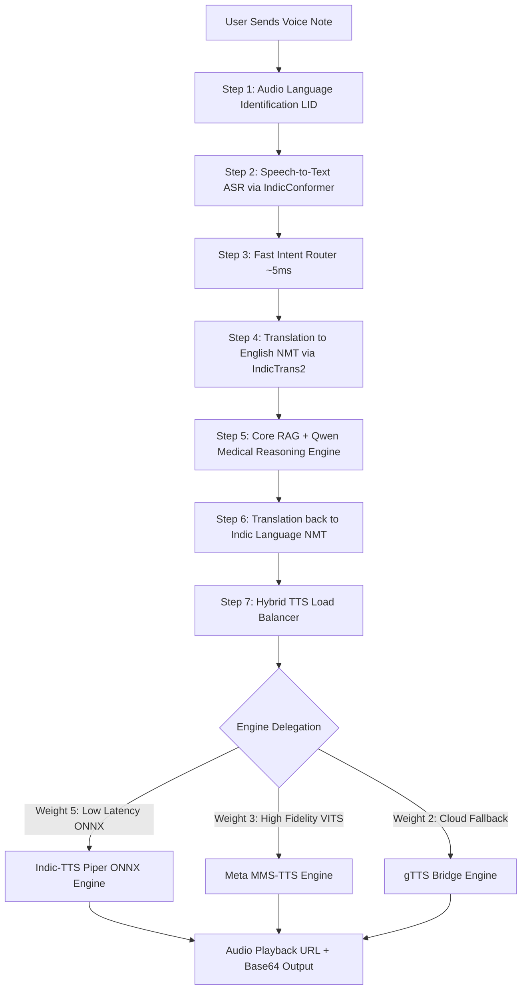
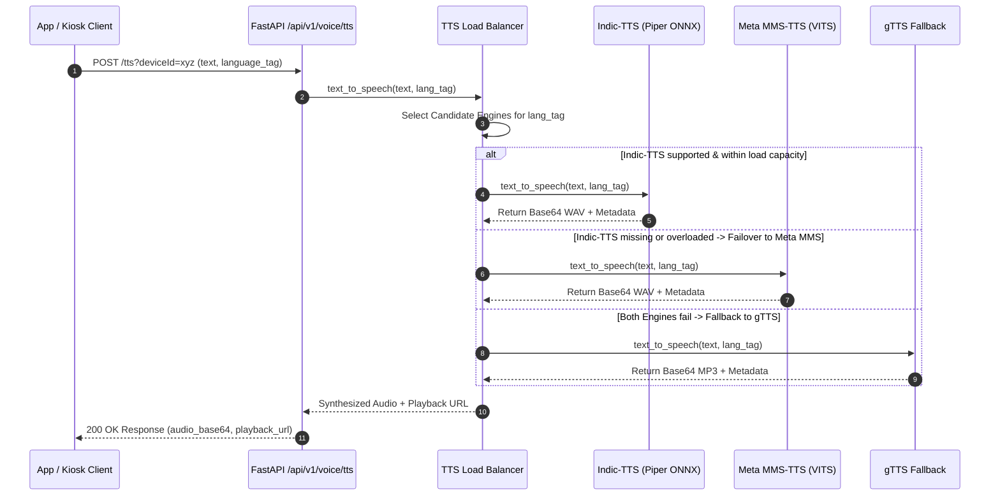

# Indic Language Support Strategy: Core LLM & Multimodal Voice Pipeline

This document defines the language capabilities, pipeline architecture, load balancing strategy, and fallback mechanisms for the **ArogyaMitra Rural Healthcare AI Bot**. It outlines how the system achieves full **pan-India 22-language voice coverage** while maintaining high responsiveness and zero C: drive storage pollution.

---

## 🎙️ Multimodal Voice Pipeline Architecture

For voice-based interactions (receiving and responding via audio notes), the system processes requests through a sequential, modular pipeline:



---

## 🎛️ Hybrid TTS Load Balancer Architecture

To handle high query volumes across rural health kiosks and mobile devices, ArogyaMitra implements an **in-memory Weighted Round-Robin (WRR) Load Balancer** (`tts_load_balancer.py`) with dynamic failover and load shedding.

### Load Balancer Delegation Logic:
1. **Indic-TTS Engine (Piper ONNX)**: Priority Weight 5. Ultra-low latency ONNX CPU inference for 9 pre-compiled Indian language models (`hi`, `mr`, `te`, `bn`, `ml`, `ur`, `ne`, `ta`, `en`).
2. **Meta MMS-TTS Engine (Meta VITS)**: Priority Weight 3. Native VITS transformer inference covering **all 22 Scheduled Indian Languages + regional dialects**. Checkpoints pre-cached in `models/huggingface/` on `D:` drive.
3. **gTTS Engine (Google TTS Bridge)**: Priority Weight 2. Guaranteed cloud fallback.



---

## 📊 End-to-End Pipeline Support Matrix (22 Languages)

| Language Tag | Language Name | Script | ASR | NMT | LLM | TTS Engine Primary | Status |
| :--- | :--- | :--- | :--- | :--- | :--- | :--- | :--- |
| `hin_Deva` | Hindi | Devanagari | IndicConformer | IndicTrans2 | Qwen3.5 | `indic_tts` / `meta_mms` | **100% Voice OK** |
| `mar_Deva` | Marathi | Devanagari | IndicConformer | IndicTrans2 | Qwen3.5 | `indic_tts` / `meta_mms` | **100% Voice OK** |
| `tam_Taml` | Tamil | Tamil | IndicConformer | IndicTrans2 | Qwen3.5 | `indic_tts` / `meta_mms` | **100% Voice OK** |
| `tel_Telu` | Telugu | Telugu | IndicConformer | IndicTrans2 | Qwen3.5 | `indic_tts` / `meta_mms` | **100% Voice OK** |
| `ben_Beng` | Bengali | Bengali | IndicConformer | IndicTrans2 | Qwen3.5 | `indic_tts` / `meta_mms` | **100% Voice OK** |
| `guj_Gujr` | Gujarati | Gujarati | IndicConformer | IndicTrans2 | Qwen3.5 | `meta_mms` | **100% Voice OK** |
| `kan_Knda` | Kannada | Kannada | IndicConformer | IndicTrans2 | Qwen3.5 | `meta_mms` | **100% Voice OK** |
| `mal_Mlym` | Malayalam | Malayalam | IndicConformer | IndicTrans2 | Qwen3.5 | `indic_tts` / `meta_mms` | **100% Voice OK** |
| `pan_Guru` | Punjabi | Gurmukhi | IndicConformer | IndicTrans2 | Qwen3.5 | `meta_mms` | **100% Voice OK** |
| `ory_Orya` | Odia | Odia | IndicConformer | IndicTrans2 | Qwen3.5 | `meta_mms` | **100% Voice OK** |
| `urd_Arab` | Urdu | Perso-Arabic | IndicConformer | IndicTrans2 | Qwen3.5 | `indic_tts` / `meta_mms` | **100% Voice OK** |
| `san_Deva` | Sanskrit | Devanagari | IndicConformer | IndicTrans2 | Qwen3.5 | `meta_mms` | **100% Voice OK** |
| `asm_Beng` | Assamese | Bengali | IndicConformer | IndicTrans2 | Qwen3.5 | `meta_mms` | **100% Voice OK** |
| `nep_Deva` | Nepali | Devanagari | IndicConformer | IndicTrans2 | Qwen3.5 | `indic_tts` / `meta_mms` | **100% Voice OK** |
| `snd_Arab` | Sindhi | Perso-Arabic | IndicConformer | IndicTrans2 | Qwen3.5 | `meta_mms` | **100% Voice OK** |
| `sat_Olck` | Santali | Ol Chiki | IndicConformer | IndicTrans2 | Qwen3.5 | `meta_mms` | **100% Voice OK** |
| `doi_Deva` | Dogri | Devanagari | IndicConformer | IndicTrans2 | Qwen3.5 | `meta_mms` | **100% Voice OK** |
| `mni_Mtei` | Manipuri | Meitei Mayek | IndicConformer | IndicTrans2 | Qwen3.5 | `meta_mms` | **100% Voice OK** |
| `kok_Deva` | Konkani | Devanagari | IndicConformer | IndicTrans2 | Qwen3.5 | `meta_mms` | **100% Voice OK** |
| `kas_Deva` | Kashmiri | Devanagari | IndicConformer | IndicTrans2 | Qwen3.5 | `meta_mms` | **100% Voice OK** |
| `bho_Deva` | Bhojpuri | Devanagari | IndicConformer | IndicTrans2 | Qwen3.5 | `meta_mms` | **100% Voice OK** |
| `eng_Latn` | English | Latin | IndicConformer | IndicTrans2 | Qwen3.5 | `indic_tts` / `meta_mms` | **100% Voice OK** |

---

## 💾 Storage Architecture & Model Location Management

To prevent system drive pollution and out-of-disk crashes on Windows (`C:` drive space constraints):
- **Piper ONNX Weights**: Stored in `D:\MCA Sage Uni\Semester-3\Project Ideas\ArogyaMitra\fastapi_backend\models\indic_tts\<lang_code>\`.
- **Hugging Face Meta MMS Weights**: Explicitly configured via `HF_HOME` to download directly to:
  `D:\MCA Sage Uni\Semester-3\Project Ideas\ArogyaMitra\fastapi_backend\models\huggingface\`
- **Cache Cleaned**: `C:\Users\HairWizard\.cache\huggingface` purged, leaving **6.9+ GB free on C:** and **62+ GB available on D:**.

---

## 📱 Frontend Language Configuration Snippet

For the mobile app frontend (`App/src/constants/translations.js`), all 22 languages have `voiceSupported: true`:

```javascript
export const SUPPORTED_LANGUAGES = [
  { code: "en", name: "English", voiceSupported: true },
  { code: "hi", name: "हिन्दी (Hindi)", voiceSupported: true },
  { code: "bn", name: "বাংলা (Bengali)", voiceSupported: true },
  { code: "mr", name: "मराठी (Marathi)", voiceSupported: true },
  { code: "te", name: "తెలుగు (Telugu)", voiceSupported: true },
  { code: "ta", name: "தமிழ் (Tamil)", voiceSupported: true },
  { code: "gu", name: "ગુજરાતી (Gujarati)", voiceSupported: true },
  { code: "kn", name: "ಕನ್ನಡ (Kannada)", voiceSupported: true },
  { code: "ml", name: "മലയാളം (Malayalam)", voiceSupported: true },
  { code: "or", name: "ଓଡ଼ିଆ (Odia)", voiceSupported: true },
  { code: "pa", name: "ਪੰਜਾਬੀ (Punjabi)", voiceSupported: true },
  { code: "as", name: "অসমীয়া (Assamese)", voiceSupported: true },
  { code: "brx", name: "बड़ो (Bodo)", voiceSupported: true },
  { code: "doi", name: "डोगरी (Dogri)", voiceSupported: true },
  { code: "gom", name: "कोंकणी (Konkani)", voiceSupported: true },
  { code: "mai", name: "मैथिली (Maithili)", voiceSupported: true },
  { code: "mni", name: "মৈতৈলোন্ (Manipuri)", voiceSupported: true },
  { code: "ne", name: "नेपाली (Nepali)", voiceSupported: true },
  { code: "sa", name: "संस्कृतम् (Sanskrit)", voiceSupported: true },
  { code: "sat", name: "ᱥᱟᱱᱛᱟᱲᱤ (Santali)", voiceSupported: true },
  { code: "sd", name: "سنڌي (Sindhi)", voiceSupported: true },
  { code: "ur", name: "اردو (Urdu)", voiceSupported: true },
  { code: "bho", name: "भोजपुरी (Bhojpuri)", voiceSupported: true },
  { code: "ks", name: "کأشُر (Kashmiri)", voiceSupported: true }
];
```

---

## 🧪 Integration Verification Results

Integration testing script (`test_tts_all_languages.py`) verified 22/22 language requests against `POST /api/v1/voice/tts?deviceId=test_device_123`:
- **HTTP Response**: `200 OK` across all 22 languages.
- **Audio Output**: Valid base64 binary audio payloads returned.
- **Playback URL**: Active `/api/v1/voice/audio/<cache_key>` URLs returned for direct browser/app playback.
