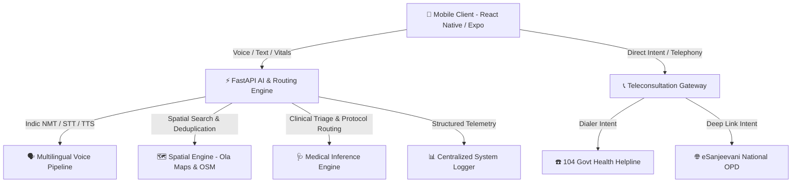

<div align="center">


# **आरोग्यमित्र** | AarogyaMitra 
### *AI Rural Healthcare Chatbot • ग्रामीण स्वास्थ्य और चिकित्सा सहायक चैटबॉट*

[](https://abdm.gov.in/)
[](https://fastapi.tiangolo.com/)
[](https://reactnative.dev/)
[](https://expo.dev/)
[](https://www.python.org/)
[](https://opensource.org/licenses/MIT)

*Bridging the healthcare divide in rural and semi-urban India through AI-driven voice guidance, smart triage, government-first healthcare discovery, and zero-cost telemedicine integration.*

---

</div>

## 🌟 Motivation & Vision

In rural India, reaching a medical professional is often a race against distance, language barriers, and critical infrastructure shortfalls. While state-of-the-art diagnostic AI models exist, they remain inaccessible to non-literate or low-bandwidth populations who need simple, empathetic, and immediate guidance in their native dialect.

**AarogyaMitra (आरोग्यमित्र)** was conceived with a clear vision: **Democratize healthcare access for every Indian citizen by turning everyday mobile devices into intelligent, multi-lingual medical companions.** By combining Indic voice interfaces, automated clinical triage, government-first healthcare facility discovery, and deep-linked telemedicine gateways, AarogyaMitra acts as a trusted digital paramedic for rural families and ASHA workers alike.

---

## 📖 Case Story

According to the *Health Dynamics of India* report released by the **Ministry of Health and Family Welfare (MoHFW)**, there is an **80% shortfall in Community Health Centres (CHCs)** across rural India.

In **Tier-2, Tier-3, and remote rural villages**, access to quality healthcare is severely constrained by:
* 👨‍⚕️ **Severe Doctor-to-Patient Ratios:** Overburdened district civil hospitals and Primary Health Centres (PHCs).
* ⏳ **Critical Waiting Delays:** Hours spent travelling over unpaved routes for basic consultation or initial triage.
* 🗣️ **Language & Literacy Barriers:** Complex health forms and English-centric health apps that alienate rural users.

Meanwhile, mobile connectivity has transformed rural communication. As of **2026**, India boasts:
* 📱 Over **740 Million** smartphone users nationwide(representing the world’s second-largest active base).
* 🌾 **548 Million+** active internet users in rural areas alone(accounting for over 57% of India's total internet user base).

> 💡 **The Core Opportunity:** What if essential healthcare guidance, first-aid triage, and emergency hospital routing could be delivered directly to rural patients and ASHA workers through intuitive, voice-enabled interfaces on platforms they already rely on?

---

## 🎯 Core Challenge

Design a resilient, low-latency, and accessible solution leveraging **AI, voice interfaces, and conversational messaging** to eliminate healthcare access bottlenecks in Tier 2/3 and rural regions.

### Essential Solution Pillars:
1. 🩺 **Verified First-Aid & Symptom Triage:** Provide instant, clinically sound guidance and emergency prioritization.
2. 🏥 **Government-First Healthcare Routing:** Connect patients with nearby CHCs, PHCs, and Civil Hospitals while prioritizing free public healthcare options.
3. 📞 **Zero-Cost Telemedicine Gateways:** Seamlessly bridge users to free government doctor consultations via eSanjeevani and state 104 helplines.
4. 🌐 **Indic Voice & Multilingual Architecture:** Native support for local languages and low-bandwidth rural networks.

---

## 💡 Goal

Empower rural communities with accessible, reliable, empathetic, and scalable healthcare support — delivered directly on their mobile devices without technical or financial barriers.

---

## 🏗️ Architecture & Core Features



### Key Ecosystem Capabilities
* 🗣️ **Multilingual & Voice-First Pipeline:** Built for intuitive voice interaction, enabling users to speak naturally in Indic dialects to describe symptoms and receive spoken advice.
* 🚑 **Smart Emergency Triage:** Categorizes symptom severity in real-time, delivering immediate first-aid steps while flagging critical conditions requiring urgent evacuation.
* 📍 **Government-First Facility Discovery:** Features a hybrid spatial engine using Ola Maps and OpenStreetMap (Overpass QL) with automated deduplication and spatial filtering to surface free government health centers (CHCs/PHCs) before private clinics.
* 📞 **3-Tier Telemedicine Integration:** 
  - **Instant Audio Triage:** One-tap telephony connection to the 24/7 National/State **104 Health Helpline**.
  - **National Video OPD:** Deep-linked integration with the official **eSanjeevani (MoHFW)** portal for free specialist video consultations.
  - **Open Digital Health Standards:** Architectural alignment with **ABDM (Ayushman Bharat Digital Mission)** and **UHI (Unified Health Interface)** specs.
* 📝 **Centralized Field Telemetry:** Unified end-to-end logging piping frontend runtime diagnostics straight to backend telemetry for remote debugging in low-connectivity zones.

---

## 🌿 Branching Strategy

To keep the development environments clean and avoid file-tracking conflicts, this repository is split across three isolated branches based on the application layer:

1. **main (Backend)**: Contains the Python **FastAPI backend** (AI routing, Vision Service, and database integration).
2. **whatsapp-app-simulation (Mobile Frontend)**: Contains the **React Native (Expo)** mobile application. This acts as the primary simulated WhatsApp interface for rural patients.
3. **whatsapp-simulation (Web Frontend)**: Contains the **React (Vite)** web application for quick browser-based simulation testing.

> **Note:** Because these branches track completely different tech stacks, they deliberately ignore each others directories. If you want to work on the backend and frontend simultaneously, it is recommended to clone the repository into two separate folders on your local machine (e.g., one folder on the main branch, and another on the whatsapp-app-simulation branch).

---

## 🚀 Getting Started

### Prerequisites
* **Node.js** (v18+ recommended) & **npm**
* **Python** (v3.11+)
* **Expo Go** app installed on your physical mobile device (Android / iOS)

### 1. Launching the FastAPI Backend
```bash
# Navigate to the backend directory
cd fastapi_backend

# Create and activate a virtual environment
python -m venv venv
# On Windows:
venv\Scripts\activate
# On Linux/macOS:
source venv/bin/activate

# Install dependencies
pip install -r requirements.txt

# Configure Environment Variables
# Create a .env file in the fastapi_backend directory and add the following keys:
# DATABASE_URL=your_postgres_connection_string
# GROQ_API_KEY=your_groq_api_key_here
# GROQ_API_URL=your_groq_api_url_here
# GROQ_MODEL=your_groq_model_name
# OLA_MAPS_KRUTRIM_CLOUD_API_BASE_URL=ola_maps_url
# OLA_MAPS_KRUTRIM_CLOUD_API_KEY=your_ola_maps_key_here
 
# Start the development server
uvicorn app.main:app --host 0.0.0.0 --port 8000 --reload
```

### 2. Launching the Mobile App (React Native / Expo)
```bash
# Navigate to the App directory
cd App

# Install npm dependencies
npm install

# Start the Expo development bundler
npx expo start
```
*Scan the QR code displayed in your terminal using the **Expo Go** app on Android or default Camera app on iOS to run the app live on your phone.*

---

### 3. Launching the Web App Simulation (React / Vite)
```bash
# Ensure you are on the whatsapp-simulation branch (or in its cloned directory)
# Navigate to the frontend web-preview directory
cd frontend/web-preview

# Install npm dependencies
npm install

# Start the Vite development server
npm run dev
```
*Open the provided local URL (usually http://localhost:5173) in your web browser to test the WhatsApp UI simulation.*


## 🛡️ License & Acknowledgments

This project is open-sourced under the [MIT License](LICENSE).

Special thanks to the **Ministry of Health and Family Welfare (MoHFW)**, **National Health Authority (NHA)**, **Ayushman Bharat Digital Mission (ABDM)**, **OpenStreetMap contributors**, and **Ola Maps** for enabling digital public infrastructure that makes equitable healthcare access possible.

<div align="center">

<h2>ArogyaMitra App: 22 Indic Languages Support</h2>

<table>
  <tr>
    <td align="center"><b>Assamese</b><br></td>
    <td align="center"><b>Bengali</b><br></td>
    <td align="center"><b>Bodo</b><br></td>
    <td align="center"><b>Dogri</b><br></td>
  </tr>
  <tr>
    <td align="center"><b>Gujarati</b><br></td>
    <td align="center"><b>Hindi</b><br></td>
    <td align="center"><b>Kannada</b><br></td>
    <td align="center"><b>Kashmiri</b><br></td>
  </tr>
  <tr>
    <td align="center"><b>Konkani</b><br></td>
    <td align="center"><b>Maithili</b><br></td>
    <td align="center"><b>Malayalam</b><br></td>
    <td align="center"><b>Manipuri</b><br></td>
  </tr>
  <tr>
    <td align="center"><b>Marathi</b><br></td>
    <td align="center"><b>Nepali</b><br></td>
    <td align="center"><b>Odia</b><br></td>
    <td align="center"><b>Punjabi</b><br></td>
  </tr>
  <tr>
    <td align="center"><b>Sanskrit</b><br></td>
    <td align="center"><b>Santali</b><br></td>
    <td align="center"><b>Sindhi</b><br></td>
    <td align="center"><b>Tamil</b><br></td>
  </tr>
  <tr>
    <td align="center"><b>Telugu</b><br></td>
    <td align="center"><b>Urdu</b><br></td>
  </tr>
</table>

</div>

